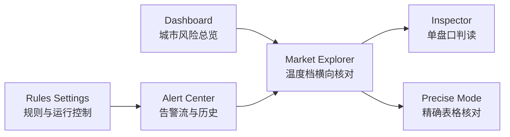
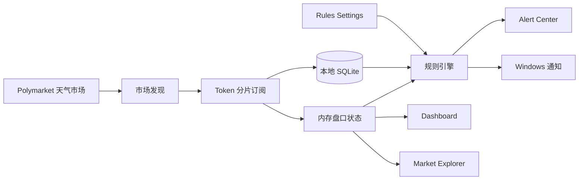

# 天气监控桌面应用


面向 Polymarket 天气预测市场的本地桌面监控工具。它把市场发现、实时盘口订阅、温度阶梯告警、规则管理、历史回放和 Windows 桌面通知放在同一个 Electron 应用里，适合长时间盯盘、复盘和运营核对。

> 当前定位：本地监控与运营辅助工具。项目不连接钱包、不保存私钥、不自动下单，也不提供自动交易能力。

## 现在能做什么

| 能力 | 当前状态 | 说明 |
| --- | --- | --- |
| Polymarket 天气市场发现 | 已可用 | 按城市、日期、温度档发现并维护可监控盘口 |
| 实时盘口订阅 | 已可用 | WebSocket 分片订阅 token，维护买一、卖一、价差、成交和深度 |
| 温度阶梯盘口斩杀 | 已更新 | 从同城同日温度阶梯判断某个 YES 温度档是否被快速归零 |
| 告警中心 | 已可用 | 告警流、历史分页、筛选、跳转到原始盘口 |
| Market Explorer | 已可用 | 城市分组、温度档横向核对、右侧检视器、精确表格模式 |
| Rules Settings | 已可用 | 内置规则、自定义规则、阈值、窗口、冷却、声音和运行控制 |
| 本地持久化 | 已可用 | SQLite 保存行情、告警、配置和运行诊断 |
| Windows 打包与快捷方式 | 已可用 | `npm run package` 后自动更新“天气监控”桌面/开始菜单快捷方式 |

## 核心规则

| 规则 | 关注什么 | 默认用途 |
| --- | --- | --- |
| `liquidity_kill` | 温度阶梯盘口斩杀 | 某个温度档 YES 曾有有效价格，短窗口内归零，并由相邻温度档确认方向 |
| `volume_pricing` | 带量定价 | 卖一被快速推高，同时有成交、旧档移除或盘口深度确认 |
| `abnormal_lottery` | 异常彩票 | 超低价 YES 卖一被异常抬升，专门盯尾部小概率事件 |
| `price_change_5m` | 5 分钟异动 | YES 价格短时间快速变化 |
| `spread_threshold` | 价差过宽 | 买一和卖一之间的价差超过阈值 |
| `feed_stale` | 数据流停滞 | 实时订阅或发现链路长时间没有新数据 |

### 盘口斩杀的新定义

新版 `liquidity_kill` 不再把任意盘口一侧清空都直接当作核心语义。它优先识别“温度阶梯斩杀”：

1. 同一城市、同一日期、同一温度阶梯内判断。
2. 被斩温度档的 YES 之前必须有有效价格，例如 `8c` 以上。
3. 当前 YES 买盘或可交易估值快速接近 `0c`。
4. 盘口深度被杀，例如买盘档位归零或可见深度大幅减少。
5. 相邻温度档必须给出确认，例如高一档走强，说明市场隐含温度锚点上移。

示例呈现：

```text
高温斩杀 | Warsaw
13°C YES 10.2c -> 0c
14°C 相邻确认
当前盘口：14°C Bid 66c / Ask 70c
说明：基于市场盘口异动推断，不代表实况数据。
```

## 点进去之后看到什么

当用户从 Alert Center 点进一条盘口斩杀告警，Market Explorer 会自动定位到原始盘口，并展示三层信息：

| 区域 | 展示内容 | 作用 |
| --- | --- | --- |
| 告警入口条 | 城市、温度档、触发规则、触发时间 | 确认这次跳转来自哪条告警 |
| 温度阶梯斩杀面板 | 被斩档、价格路径、相邻确认档、判读窗口 | 用一屏说明为什么触发 |
| 同城横向核对 | 同城同日多个温度档的 Bid / Ask / YES | 对照锚点是否真的发生迁移 |
| 右侧检视器 | YES/NO、买一、卖一、价差、5 分钟变化 | 保留单盘口精确核对 |
| 精确模式 | 表格列高亮告警对应指标 | 用于批量排查和逐行比对 |

## 产品视图



| 页面 | 主要职责 | 适合回答的问题 |
| --- | --- | --- |
| Dashboard | 城市级风险总览 | 现在最值得看的城市在哪里？ |
| Market Explorer | 温度档横向核对和单盘口检视 | 某个城市/日期下哪个温度档正在变化？ |
| Alert Center | 告警流、历史和跳转 | 哪些告警触发了，点进去怎么看？ |
| Rules Settings | 规则、声音、运行和存储控制 | 规则如何触发，系统现在是否健康？ |

## 监控链路



## 系统要求

- Windows 10/11
- Node.js 18+
- npm
- 可安装或编译 Electron 原生模块的本地环境
- 如访问 Polymarket 需要代理，请先配置系统代理或相关环境变量

## 快速开始

```bash
npm install
npm run start
```

如果本地 Node 或 Electron 运行时切换过，`better-sqlite3` 可能需要重建：

```bash
npm rebuild better-sqlite3
```

## 常用命令

| 命令 | 作用 |
| --- | --- |
| `npm run start` | 开发启动 Electron 应用 |
| `npm run typecheck` | TypeScript 类型检查 |
| `npm test` | 运行 Vitest 测试 |
| `npm run package` | 生成可直接运行的桌面包 |
| `npm run make` | 生成安装包和发布产物 |
| `npm run shortcuts:update` | 更新 Windows 桌面和开始菜单快捷方式 |

桌面包默认输出到上一级目录的 `warning-app-artifacts`，快捷方式名称为“天气监控”。

## 版本记录

完整记录见 [CHANGELOG.md](CHANGELOG.md)。

| 日期 | 快照 | 新增重点 |
| --- | --- | --- |
| 2026-05-09 | 温度阶梯斩杀 | 盘口斩杀改为温度阶梯语义，新增点击后斩杀详情面板和相邻档核对 |
| 2026-05-08 | 当前主线整理 | 规则管理、市场总览、告警中心和异常彩票链路继续收敛 |
| 2026-05-01 | 规则重整 | 异常彩票移动到规则管理，Market Explorer 保留上下文展示 |
| 2026-04-28 | 应用快照 | 桌面监控主流程、数据持久化、打包链路进入可用状态 |
| 2026-04-23 | 工作流重构 | 告警、规则、Dashboard 工作流完成大幅调整 |
| 2026-04-22 | 市场总览升级 | 泡泡总览、市场工作台、规则管理、中文告警体验集中增强 |

## 数据与隐私

- 数据默认保存在本地 SQLite，不依赖独立云端数据库。
- 运行日志、数据库、缓存和会话文件不应提交到仓库。
- 仓库只保留源码、测试、脚本和文档。
- 本项目不会保存钱包私钥，也不提供钱包连接或交易执行能力。

## 项目结构

```text
src/
  core/        后台 worker、市场数据、规则引擎、数据库仓库
  main/        Electron 主进程、IPC、窗口、托盘、通知
  renderer/    React 页面、组件、样式和前端状态
  shared/      前后端共享类型、告警展示和规则语义
tests/         单元测试与行为测试
docs/          研究、设计、需求和路线图文档
scripts/       打包、验证、运行时准备和快捷方式脚本
```

## 路线图

- 用更长时间的真实盘口数据继续校准温度阶梯斩杀、带量定价和异常彩票阈值。
- 增强同城同日温度阶梯的历史回放能力。
- 继续统一规则配置、运行诊断和告警复盘体验。
- 让 GitHub README、CHANGELOG、打包产物和桌面快捷方式保持同步。

更完整的阶段规划见 [架构路线图](docs/plan/20260413_architecture_roadmap.md)。

## 许可证

`MIT`
