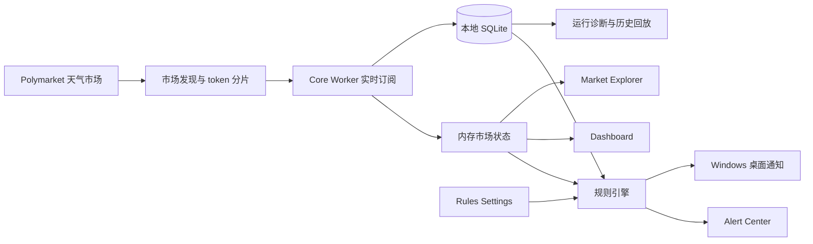

# 天气监控桌面应用


面向 Polymarket 天气市场的本地桌面监控工具。它把市场发现、实时订阅、盘口异动、规则告警、历史回放和 Windows 桌面通知放在一个可长期驻留的 Electron 应用里，适合持续观察天气预测市场的价格与流动性变化。

> 当前定位：本地监控与运营辅助工具。项目不包含自动下单、钱包连接或自动交易能力。

## 目录

- [当前状态](#当前状态)
- [核心功能](#核心功能)
- [产品视图](#产品视图)
- [监控链路](#监控链路)
- [系统要求](#系统要求)
- [快速开始](#快速开始)
- [常用命令](#常用命令)
- [数据与隐私](#数据与隐私)
- [版本记录](#版本记录)
- [项目结构](#项目结构)
- [路线图](#路线图)

## 当前状态

| 项目 | 状态 | 说明 |
| --- | --- | --- |
| 桌面端形态 | 已落地 | Windows / Electron，本地运行、本地存储、可打包 |
| 市场发现与订阅 | 已落地 | 支持 Polymarket 天气市场发现、分片订阅、状态维护 |
| 告警引擎 | 已落地 | 内置系统规则 + 自定义规则，支持冷却、去重、范围限定 |
| 市场工作台 | 已落地 | 市场总览、筛选、排序、可视化定位、右侧检视器 |
| 告警中心 | 已落地 | 告警流、分页、历史查看、确认处理 |
| 规则管理 | 已落地 | 系统规则、自定义规则、规则范围、触发摘要、静音配置 |
| 持久化 | 已落地 | SQLite 数据库、迁移、归档、运行诊断 |
| 交易能力 | 不提供 | 不连接钱包，不自动下单，不做自动交易 |

截至 `2026-05-08`，主分支最新快照已通过：

```bash
npm run typecheck
npm test
```

## 核心功能

### 1. 实时市场监控

- 发现并跟踪 Polymarket 天气相关市场
- 按 token 分片订阅 WebSocket 行情
- 维护城市、日期、温度区间、价格、价差、5 分钟变化、更新时间等状态
- 支持 watchlist 与市场上下文查询

### 2. 规则与告警

内置系统规则覆盖当前最重要的监控场景：

| 规则 | 用途 |
| --- | --- |
| `price_change_5m` | 监控 5 分钟内的短时价格异动 |
| `spread_threshold` | 监控买一和卖一价差过宽 |
| `feed_stale` | 监控实时数据流停滞 |
| `liquidity_kill` | 监控买盘或卖盘现价盘口被快速清空 |
| `volume_pricing` | 监控卖一被快速推高且有成交或盘口量确认 |
| `abnormal_lottery` | 监控超低价 YES 卖一被异常推高的尾部事件 |

自定义规则支持：

- 城市、日期、温度区间、方向、单一市场范围限定
- 阈值、窗口、冷却时间、去重窗口、权重配置
- 系统规则复制为自定义规则后再细调
- 告警展示、桌面通知和历史回放中的中文语义化摘要

### 3. 异常彩票监控

“异常彩票”已经从 Market Explorer 顶层筛选入口收口到 Rules Settings 中的系统规则。当前规则更像一个超低价特化队列：

- 参考卖一不高于 `4c`
- 观察窗口约 `60s`
- 当前卖一不高于 `18c`
- 低价越低，触发越敏感
- 至少需要一种确认来源：旧低价卖单被移除、成交确认或盘口深度确认

研究与实现说明见 [异常彩票监控研究文档](docs/research/20260429154818159_abnormal-lottery-monitoring.md)。

## 产品视图

| 页面 | 主要职责 | 适合回答的问题 |
| --- | --- | --- |
| Dashboard | 风险总览与城市级观察 | 现在最值得看的城市在哪里？ |
| Market Explorer | 市场筛选、可视化定位、单市场检视 | 某个城市/日期下哪个盘口正在变化？ |
| Alert Center | 告警流、历史、分页、确认 | 哪些告警已触发，哪些还没处理？ |
| Rules Settings | 系统规则、自定义规则、规则范围 | 规则怎么触发，应该监控哪些市场？ |

Market Explorer 已从传统表格升级为监控工作台：默认强调可扫读的市场总览与右侧检视器，同时保留精确明细模式用于核对数据。

## 监控链路



## 系统要求

- Windows 10/11
- Node.js 18+
- npm
- 可编译或安装 Electron 原生模块的本地环境
- 如本机访问 Polymarket 需要代理，请先配置系统代理或相关环境变量

## 快速开始

```bash
npm install
npm run start
```

如果本地 Node 版本或 Electron 运行时切换过，`better-sqlite3` 可能需要重建：

```bash
npm rebuild better-sqlite3
```

## 常用命令

| 命令 | 作用 |
| --- | --- |
| `npm run start` | 开发启动 Electron 应用 |
| `npm run lint` | 运行 ESLint |
| `npm run typecheck` | TypeScript 类型检查 |
| `npm test` | 运行 Vitest 测试 |
| `npm run package` | 生成可直接运行的桌面包 |
| `npm run make` | 生成安装包和发布产物 |
| `npm run shortcuts:update` | 更新 Windows 桌面和开始菜单快捷方式 |

桌面包默认输出到上一级目录下的 `warning-app-artifacts`。

## 数据与隐私

- 数据默认保存在本地 SQLite 中，不依赖独立云端数据库
- 运行日志、数据库、缓存和会话文件不应提交到仓库
- 仓库只保留源码、测试、脚本和文档
- 本项目不会保存钱包私钥，也不提供钱包连接或交易执行能力

## 版本记录

完整版本记录放在根目录 [CHANGELOG.md](CHANGELOG.md)，GitHub 文件列表和本 README 都可以直接进入。

| 日期 | 快照 | 重点 |
| --- | --- | --- |
| 2026-05-08 | 当前主线 | 规则管理、市场总览、告警中心和异常彩票链路继续收敛 |
| 2026-05-01 | 规则重整 | 异常彩票移动到规则管理，Market Explorer 保留上下文展示 |
| 2026-04-28 | 应用快照 | 桌面监控主流程、数据持久化、打包链路进入可用状态 |
| 2026-04-23 | 工作流重构 | 告警、规则、Dashboard 工作流完成大幅调整 |
| 2026-04-22 | 市场总览升级 | 泡泡总览、市场工作台、规则管理、中文告警体验集中增强 |

## 项目结构

```text
src/
  core/        后台 worker、市场数据、规则引擎、数据库仓库
  main/        Electron 主进程、IPC、窗口、托盘、通知
  renderer/    React 页面、组件、样式和前端状态
  shared/      前后端共享类型、告警展示和规则语义
tests/         单元测试与行为测试
docs/          研究、设计、需求和路线图文档
scripts/       打包、验证、运行时准备和快捷方式脚本
```

## 路线图

近期重点：

- 用更长时间真实运行数据校准异常彩票、带量定价和盘口斩杀阈值
- 完成内存遥测与长时间运行稳定性观察
- 继续统一规则配置、运行诊断和历史回放能力
- 增强发布流程，让版本说明、打包产物和 GitHub 展示保持一致

更完整的阶段规划见 [架构路线图](docs/plan/20260413_architecture_roadmap.md)。

## 许可证

`MIT`
